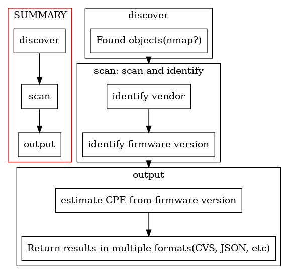

# nwfrm2cpe

nwfrm2cpe is NetWorkFiRMwareToCPE(common Platform Enumeration).
A tool that scans network equipment and acquires CPE Names.

##  overview

- discover
  - Scan the network to locate  network equipment.
- scan
  - Identify the firmware version and device model number using SNMP or SSH.
  - Convert the obtained information into CPE.
    - `cpe:2.3:o:<firmware>`, `cpe:2.3:h:<hardware>`
- output
  - Output target CPE information.
    - csv, json, etc

## Installing

This program is written in python3.

-  lib: pysnmp(SNMP), praramiko(SSH), python3-nmap(nmap)

##  Detail
### SNMP

In hogehuga/snmp2cpe, information was obtained by sysDescr, but this time it is obtained by entPhysicalSoftwareRev.
- It is unclear whether sysDescr is appropriate, so I decided to use entPhysicalSoftwareRev, which is clearly the software version.
-  entPhysicalSoftwareRev: .1.3.6.1.2.1.47.1.1.1.1
   -  examples;
      -  cisco: `15.4(3)M3, RELEASE SOFTWARE (fc2)`
      -  forti: `FortiGate-60D v5.2.5,build0701b701,151203 (GA)`

The acquisition method of hardware information is under confirmation.
- Get with SSH
  - `show version`(Cisco), `get version status`(fortigate)
- Get with snmp
  - entPhysicalModelName(.1.3.6.1.2.1.47.1.1.1.1.13)
    - Cisco: I don't have information.
    - Forti: exsample; "FGT_60D"

Below is a summary of the information currently available.
 - appendix/data.md

# HELP ME!

I want to identify the OID to check.
I'm wondering if I should check this OID.

- sysDescr.0 (but, the contents of the output depend on the situation.)
- entPhysicalMfgName
- entPhysicalSoftwareRev
- entphysicalName

## I want to..

1. ./getMibDataList.sh command execution result. or snmpwalk(entPhysicalMfgName,entPhysicalSoftwareRev,entphysicalName) results.
2. (If possible) result of snmpwalk on OID as ".1". (Please mask confidential information.)
3. please send the above by ... Issue or [googleForms](https://docs.google.com/forms/d/e/1FAIpQLSdGFJAxH7JV3c6kBP94jo1rvZAi1HM-E11wDyx1kZKWJIf1wA/viewform?usp=sf_link).
